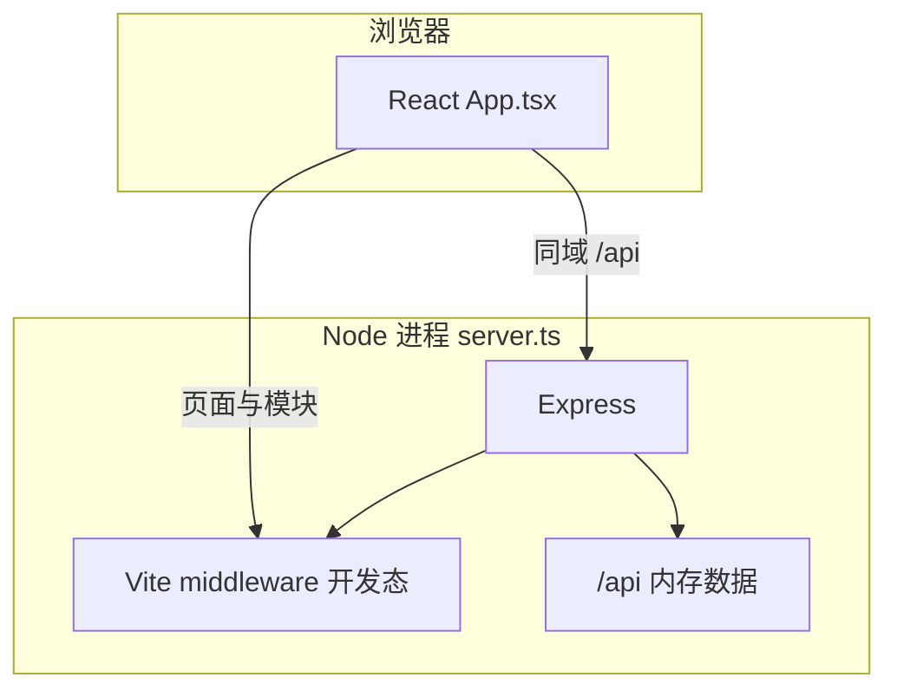

# ePal Gaming Companion（epal-gaming）

游戏陪玩 / 社区类前端演示项目：单页 React 应用 + 同进程 Express 开发服务器，内置模拟充值与钱包 API。产品元数据见根目录 `metadata.json`。

---

## 技术栈

| 层级 | 技术 |
|------|------|
| 运行时 | Node.js |
| 前端框架 | React 19（`StrictMode`） |
| 构建与 HMR | Vite 6（`@vitejs/plugin-react`） |
| 语言 | TypeScript 5.8（`tsc --noEmit` 校验） |
| 样式 | Tailwind CSS 4（`@tailwindcss/vite`） |
| 动效 | Motion（`motion/react`，含 `AnimatePresence`） |
| 图标 | Lucide React |
| 服务端 | Express 4 |
| 开发执行 | `tsx`（直接运行 TypeScript） |

**说明：** 依赖中包含 `@google/genai`，当前业务代码未引用；`vite.config.ts` 会将 `GEMINI_API_KEY` 注入为 `process.env.GEMINI_API_KEY`，便于后续接入 AI 能力。

---

## 项目架构

开发模式下由 **`server.ts` 单一入口** 同时承担：

1. **Express**：注册 JSON 中间件与 `/api/*` 路由，内存中维护充值订单、钱包、流水与风控状态。
2. **Vite（middleware 模式）**：挂载 `vite.middlewares`，由 Vite 处理前端资源与热更新。

生产构建后，Express 改为托管 `dist` 静态资源并 `SPA fallback`。



**前端路由方式：** 无 React Router。`App.tsx` 内用 `useState<View>` + `viewHistory` 栈模拟多「页面」切换（`View` 为字符串联合类型）。

**数据分层：**

- **展示与交互数据**：`src/constants.ts` 中的 `GAMES`、`EPALS`、`POSTS` 等（前端静态模拟）。
- **钱包 / 充值**：由服务端内存维护；进程重启后丢失（非持久化数据库）。

---

## 目录与文件职责

```
epal-gaming/
├── server.ts              # Express + Vite 启动、全部 REST API 与内存状态
├── vite.config.ts         # React、Tailwind、路径别名 @、GEMINI 环境变量 define
├── index.html             # 入口 HTML（挂载 #root）
├── package.json           # 脚本与依赖
├── .env.example           # 环境变量示例（Gemini / APP_URL）
├── metadata.json          # 应用名称与描述（AI Studio 等场景）
├── find_duplicate_keys.js # 辅助脚本（排查重复 key）
└── src/
    ├── main.tsx           # ReactDOM createRoot，挂载 App
    ├── index.css          # 全局样式（含 Tailwind）
    ├── App.tsx            # 主界面：视图切换、子组件、钱包/充值请求
    ├── types.ts           # 领域 TypeScript 类型（与 server 共享部分模型）
    └── constants.ts       # 游戏、ePal、帖子等 mock 数据
```

---

## `App.tsx` 中的主要 UI 构件（非独立文件）

以下为同一文件内定义的可复用片段，便于检索与拆分重构：

| 名称 | 作用 |
|------|------|
| `GlassCard` | 玻璃态卡片容器 |
| `IconButton` | 大图标分类按钮 |
| `WaveAnimation` | 语音波形动画 |
| `EPalCard` / `LegendEPalCard` | 陪玩卡片 |
| `GameGridItem` | 游戏网格项 |
| `CoinIcon` | 代币图标 |
| `WalletView` | 钱包余额、套餐、流水与筛选 |
| `RechargeView` | 充值套餐与支付方式检测 |
| `SettingsSubPage` | 设置子页通用布局 |
| `NavButton` | 底部导航按钮 |

**`View` 类型（节选）：** `HOME`、`COMMUNITY`、`GAME_DETAIL`、`IM`、`WALLET`、`RECHARGE`、`APPLY_PLAYER`、`SETTINGS`、`MY_ORDERS` 等（完整列表见 `App.tsx` 中 `type View = ...`）。

**当前用户：** 钱包相关接口使用硬编码 `userId = 'user_1'`（与 `server.ts` 中预置钱包一致），无登录态与 JWT。

---

## HTTP API（`server.ts`）

除 Vite 处理的静态与模块请求外，以下为 Express 注册的接口。请求体均为 JSON（除 GET 查询参数）。

| 方法 | 路径 | 说明 |
|------|------|------|
| `GET` | `/api/recharge/packages` | 返回充值套餐列表 |
| `POST` | `/api/recharge/create` | 创建订单；body：`userId`, `packageId`, `paymentMethod`；含每日充值上限风控 |
| `POST` | `/api/recharge/verify` | 模拟支付回调；body：`orderId`, `transactionId`, `status`；成功时入账并可能触发人工审核（高频） |
| `GET` | `/api/wallet/balance` | 查询参数：`userId` |
| `GET` | `/api/wallet/transactions` | 查询参数：`userId` |
| `POST` | `/api/admin/recharge/manual` | 人工审核；body：`orderId`, `adminId`, `action`（`APPROVE` \| `REJECT`） |
| `POST` | `/api/recharge/chargeback` | 拒付/退款模拟；body：`transactionId` |

前端钱包与充值使用 **相对路径** `fetch('/api/...')`，与页面同域同端口，无需单独配置 `VITE_API_BASE_URL`。

---

## 环境变量

| 变量 | 用途 |
|------|------|
| `GEMINI_API_KEY` | 预留：Vite 注入 `process.env.GEMINI_API_KEY`（当前 UI 未调用 Gemini） |
| `APP_URL` | 示例中用于托管/OAuth 等说明（`server.ts` 未读取） |
| `NODE_ENV` | 设为 `production` 时走 `dist` 静态托管 |

复制 `.env.example` 为 `.env` 或 `.env.local` 并按需填写即可。

---

## 常用命令

```bash
# 安装依赖
npm install

# 开发：启动 Express（端口 3000）+ Vite 中间件
npm run dev

# 仅类型检查（无测试框架配置）
npm run lint

# 生产构建
npm run build

# 预览生产构建（需先 build；预览命令见 package.json）
npm run preview
```

**访问地址：** 开发服务器监听 `0.0.0.0:3000`，本机 `http://localhost:3000`，局域网内其他设备使用本机局域网 IP（如 `http://192.168.x.x:3000`）。若 Windows 防火墙拦截，需放行 Node 或该端口。

---

## 构建与部署注意

- `npm run build` 产出 `dist/`；生产模式需 `NODE_ENV=production` 运行 `server.ts`（或等价托管静态目录 + 反向代理 API）。
- 当前无 Docker / CI 配置；数据库、会话、真实支付均未接入。

---

## 已知边界（便于后续迭代）

- 用户体系为 mock（固定 `user_1`），无注册登录与鉴权。
- 钱包、订单、流水均在内存中，重启清空。
- 支付为模拟流程（`verify` 接口），非真实网关。
- 社区、IM、订单等大量流程依赖 `constants.ts` 与组件内 state，与后端未全量打通。

如需将本说明与内部「La3eb」规范对齐，可在团队文档中引用本 README 的架构与 API 章节并补充版本与发布流程。
